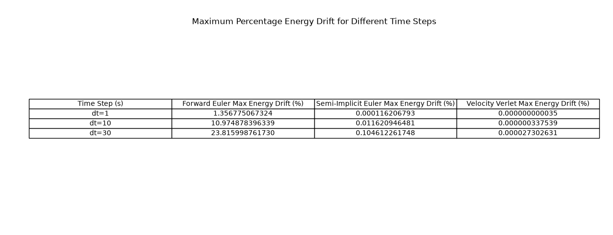
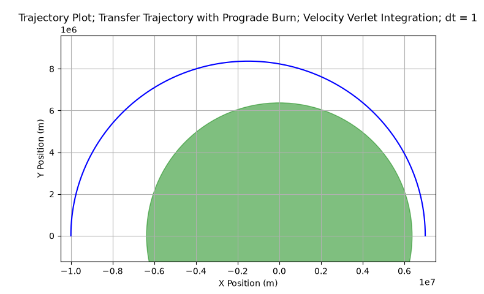

# Orbit Simulator
  
## Overview
This is a project that simulates orbital physics, allowing for scenario calculations and verification. It is made as a learning project exploring orbital mechanics and simulation.
## Features
| Category | Features |
| :--- | :--- |
| **Integrators** | • Forward Euler • Semi-Implicit Euler • Velocity Verlet |
| **Simulation** | • Simulate spacecraft state as a `BodyState` class based on input parameters • Optional collision checking |
| **Diagnostics** | • Calculation of orbital variables (e.g. eccentricity, semi-major axis, periapsis/apoapsis) • Calculation of events (e.g. periapsis/apoapsis target time, escape velocity) |
| **Plots** | • Plotting of orbit trajectory • Plotting of specific values of interest via tables |
| **Tests** | • Verification of calculation functions against known correct values |
| **Maneuvers** | • Applying impulsive velocity `ΔV` to the spacecraft |
| **Collisions** | • Checking of the state of the spacecraft and Earth, returning either the current state being a collision or not a collision |
## Physics model
- Two-dimensional
- Newtonian gravity
- SI units
- No atmospheric calculations
- No multi-body calculations\
Example gravitational acceleration equation; Input parameters `Vector2(x, y)`:\
$\mu = GM;\  \mu_{Earth} = 3.98589196\times 10^{14}\ m^{3}/s^{2}$\
$r = \sqrt{x^{2}+y^{2}}$\
$a_{x} = -(\frac{\mu_{Earth}\times x}{r^{3}})$\
$a_{y} = -(\frac{\mu_{Earth}\times y}{r^{3}})$
## Numerical integration
Integration is a method to simulate orbital paths, this project implements 3 methods with varying accuracy: `Forward Euler`, `Semi-Implicit Euler`, `Velocity Verlet`. Precise accuracy percentage can be viewed in `scenario_plots/integrator_validation_6.png`.
## Installation
Requires **Python** and **Matplotlib**. If your device doesn't have Matplotlib installed, run this command in the terminal: `pip install matplotlib`.\
\
Download the repository as a *.zip* file then extract it in your preferred location.
## Usage
After a successful installation, open a terminal window in the installed folder and run these commands:
| Command | Description |
| :--- | :--- |
| `python main.py integrators` | Comparison and visualisation of different integration methods |
| `python main.py orbits` | Simulate and plot elliptical and hyperbolic escape orbits |
| `python main.py maneuvers` | Examples of in-orbit maneuvering |
| `python main.py collision` | Demonstration of collision via a descending orbit |
| `python -m unittest discover -s tests` | Test unit of diagnostic functions |
## Validation and results
Note: Using Earth as reference body at origin `(0, 0)`

Results show Velocity Verlet reaches a drift of `0.0000273%` at `Δt=30` over the tested parameters, followed by Semi-Implicit Euler with `0.1046%`, and lastly Forward Euler with a `23.82%` drift.

Trajectory plot of an impulsive prograde burn, specifically a Hohmann transfer ellipse, raising apoapsis to 10,000,000 meters from 7,000,000 meters.
## Project structure
| Module | Purpose(s) |
| :--- | :--- |
| `collision.py` | Collision check functions |
| `constants.py` | Constant definitions |
| `diagnostics.py` | Orbital variables calculation functions |
| `gravity.py` | Gravitational acceleration calculation |
| `integrators.py` | Integrator methods functions |
| `main.py` | Main scenario simulation launcher |
| `maneuvers.py` | Orbital maneuver functions |
| `plotter.py` | Trajectory/table plotting functions |
| `scenarios.py` | Function cluster of different scenarios |
| `simulation.py` | Modular simulation function |
| `state.py` | Dataclass library |
| `validation.py` | Validation of energy drift for each integrators |
| `tests/test_collisions.py` | Test unit for collisions |
| `tests/test_diagnostics.py` | Test unit for diagnostics |
| `tests/test_maneuvers.py` | Test unit for maneuvers |
## Limitations
- Two-dimensional
- No atmospheric resistance
- No multi-body simulation
- Unrealistic ideal impulsive burns
- Approximate collision interpolation
- Finite timesteps, causing numerical errors
## Future work
- Multi-body simulation
- More accurate collision roots
- Interactive control playground
- Time acceleration
- Real Solar System data